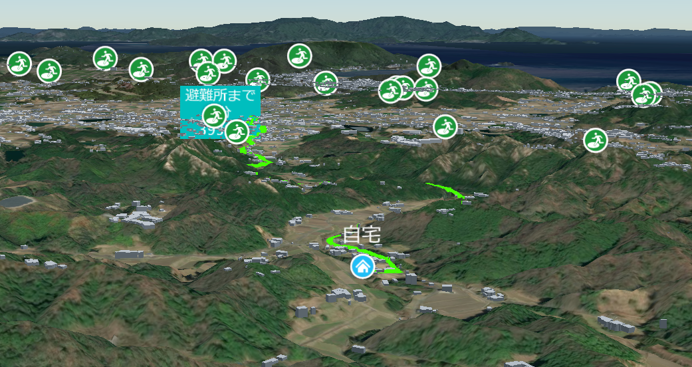

# 地区防災計画作成支援システム

## 1. 概要
本リポジトリでは、Project PLATEAUの令和6年度のユースケース開発業務の一部であるUC24-012「地区防災計画作成支援ツールの開発」について、その成果物である「地区防災計画作成支援システム」のソースコードを公開しています。また、「地区防災計画作成支援システム」内で利用する Re:Earth プラグインについても公開しています。

「地区防災計画作成支援システム」は、3D都市モデルや災害リスク情報を活用し、地区防災計画の作成を支援するためのシステムです。

## 2. 「地区防災計画作成支援システム」について
「地区防災計画作成支援システム」は、地区防災計画の作成を支援することを目的として開発しました。

本システムの詳細については[技術検証レポート](https://www.mlit.go.jp/plateau/file/libraries/doc/plateau_tech_doc_0107_ver01.pdf)を参照してください。

### Re:Earth とは

[Re:Earth](https://reearth.io/)はノーコードで扱える WebGIS（地理情報システム）プラットフォームです。地理空間データの管理、分析、可視化を GUI 操作のみで実行できるように設計されています。Re:Earth は、ブラウザ上で動作するため、インストール不要でアクセス可能です。GeoJSON、Shapefile、CZML、KML など、様々な標準 GIS データフォーマットに対応しており、クリック操作とドラックアンドドロップのみで、データの分析と可視化を行えます。  
Re:Earth はプラグインによる機能拡張が可能となっており、用途に合わせて利用者自らが新機能の開発や既存機能のカスタマイズを行えます。プラグインが格納された zip ファイルを Re:Earth の編集画面（Re:Earth Editor）にてアップロードすることで、プラグイン機能の利用が可能となります。
なお本システムでは Re:Earth のバージョンアップ版である Re:Earth Visualizer （以下 Vizualizer）を利用している。

## 3. 利用手順
本システムの構築手順及び利用手順については[利用チュートリアル](https://project-plateau.github.io/Disaster-Prevention-Planner/)を参照してください。

## 4. システム概要
### 【個別避難計画作成】
#### ①住民情報の登録
- Visualizer に表示されている3D都市モデルから自宅を選択
- 家族構成、避難時の交通手段、緊急連絡を登録

#### ②リスク情報確認
- ①で登録した自宅から、自宅のリスク情報を表示
- 自宅の周辺のリスク情報も併せて表示

#### ③避難情報
- 避難に関する情報を登録

#### ④避難ルート検索
- ①で登録した自宅から避難場所までの避難ルートを検索し、表示
- 経由地があれば選択でき、経由地を経由した避難ルートも検索可能

#### ⑤避難のタイミング
- 避難までの準備やそのときにすることを時系列で登録

#### ⑥非常持出
- 避難時に持ち出すものを登録

#### ⑦個別避難計画
- ①～⑥で登録した情報をもとに、個別避難計画を作成
- 個別避難計画は、ExcelまたはPDFファイルでダウンロード可能

#### ⑦リスク情報登録
- 地区のリスク情報を写真とコメント付きで投稿可能

### 【地区防災計画作成】

#### ①地区特性
- 地区の特性（どのような災害があるか等）を登録

#### ②倉庫リスト
- 地区の防災倉庫を登録

#### ③物資リスト
- 防災倉庫に保管されている物資を登録

#### ④地区一次避難場所
- 地区で定められている一次避難場所を登録

#### ⑤人的資源
- 地区で特別な技能や資格を有している人を登録

#### ⑥連絡体制
- 地区の連絡網を登録

#### ⑦緊急連絡先
- 緊急連絡先（警察や消防など）を登録

#### ⑧地区特有の情報
- 地区で共有する情報（災害伝承碑など）を登録

#### ⑨自治会館
- 地区の自治会館を登録

#### ⑩災害図上訓練コンテンツ
- 災害図上訓練で使用するコンテンツを表示し、訓練を行った記録を登録

#### ⑪地区防災計画
- ①～⑪で登録した内容をもとに、地区防災計画を作成
- 作成した地区防災計画は、Excel形式とPDF形式でダウンロード可能

#### ⑫マスタ情報
- マスタ情報を登録

### 【地区防災計画管理】

#### ①地区防災計画確認
- どの地区が地区防災計画を作成しているかを確認可能
- 各地区の地区防災計画をダウンロード可能

#### ③地区防災計画確認（地図）
- どの地区が地区防災計画を作成しているかを地図上で確認可能

## 5. 利用技術

| 種別 | 名称 | バージョン |
| ----------------- | --------|-------------|
| OS | Ubuntu | 22.04.3 LTS |
| Webサーバ | Apache | 2.4.41 |
| Webフレームワーク | Laravel | 11.38.2 |
| Webアプリインタプリタ | PHP | 8.2.27 |
| Webアプリライブラリ | PhpSpreadsheet | 3.8 |
| | jQuery | 3.7.1 |
| | jQuery UI | 1.14.1 |
| | Leaflet | 1.9.4 |
| データベース | MySQL | 8.0 |
| ソフトウェア | libreoffice | 6.4.7.2 |

## 6. 動作環境 <!-- 動作環境についての仕様を記載ください。 -->
| 項目               | 最小動作環境                                                                                                                                                                                                                                                                                                                                    | 推奨動作環境                   | 
| ------------------ | ------------------------------------------------------------------------------------------------------------ | ------------------------------ | 
| OS                 | Linux                                                                        |  同左 | 
| CPU                | Intel Core i3以上                                                                                                                                | Intel Core i5以上              | 
| メモリ             | 4GB以上                                                                                                                                         | 8GB以上                        | 
| ディスプレイ解像度 | 不問                                                                                                                                         |  同左                   | 
| ネットワーク       | 不要 |  同左                            | 

## 7. 本リポジトリのフォルダ構成
| フォルダ名 |　詳細 |
|-|-|
| system | システム本体 |
| plugin | Re:Earth プラグイン |

## 8. ライセンス

- ソースコード及び関連ドキュメントの著作権は国土交通省に帰属します。
- 本ドキュメントは[Project PLATEAUのサイトポリシー](https://www.mlit.go.jp/plateau/site-policy/)（CCBY4.0及び政府標準利用規約2.0）に従い提供されています。

## 9. 注意事項

- 本リポジトリは参考資料として提供しているものです。動作保証は行っていません。
- 本リポジトリについては予告なく変更又は削除をする可能性があります。
- 本リポジトリの利用により生じた損失及び損害等について、国土交通省はいかなる責任も負わないものとします。

## 10. 参考資料
- 技術検証レポート: https://www.mlit.go.jp/plateau/file/libraries/doc/plateau_tech_doc_0107_ver01.pdf
- PLATEAU WebサイトのUse caseページ「地区防災計画作成支援ツールの開発」: https://www.mlit.go.jp/plateau/use-case/uc24-12/

