# 環境構築手順書(Re:Earth Visualizer)

# 1 本書について

本書では、地区防災計画作成支援システム(以下 本システム)内で利用しているRe:Earth Visualizer(以下 Visualizer)の利用環境構築手順について記載しています。本システムの構成や仕様の詳細については以下も参考にしてください。

[技術検証レポート](https://www.mlit.go.jp/plateau/file/libraries/doc/plateau_tech_doc_0107_ver01.pdf)

# 2 Visualizer 構成
本システムで利用するVisualizerコンテンツは以下となっています。
また、各コンテンツで利用しているプラグインも記載しています。

| 名称 | 利用しているページ | 利用しているプラグイン |
|:---|:---|:---|
| 自宅情報 | 住民情報ページ | resident.zip |
| 自宅のリスク | 自宅のリスクページ | risk.zip |
| 自宅周囲のリスク | 自宅のリスクページ | risk2.zip |
| 避難ルート検索 | 避難ルート検索ページ | route.zip |
| スクリーンキャプチャ | 自宅のリスク、避難ルート検索ページ | screen.zip |
| 建物選択 | 自治会ページ | bldgSelect.zip |
| 位置選択 | 自治会ページ | position.zip |
| 地図確認 | 行政ページ | map.zip |

# 3 準備物
各プラグインをGitHubリポジトリより取得してください。
```sh
git clone https://github.com/Project-PLATEAU/Disaster-Prevention-Planner.git
```

各プラグインは、pluginディレクトリ以下にあります。  
[plugin](https://github.com/Project-PLATEAU/Disaster-Prevention-Planner/tree/main/plugin)

# 4 稼働環境構築
## 4-0 Re:Earth Visualizer
Re:Earth Visualizerの公式Webページにてユーザアカウントを作成します。

## 4-1 プラグインについて
すべてのプラグインは、

1. プロジェクトを作成
2. プロジェクトのプラグインから各プラグインをインストール
3. プラグインの設定

を行うことで利用可能となります。
プラグインのインストール、設定は各プラグインで共通です。

## 4-2 プロジェクトを作成
Visualizerにログインし、「新規プロジェクト」をクリックしプロジェクトを作成します。

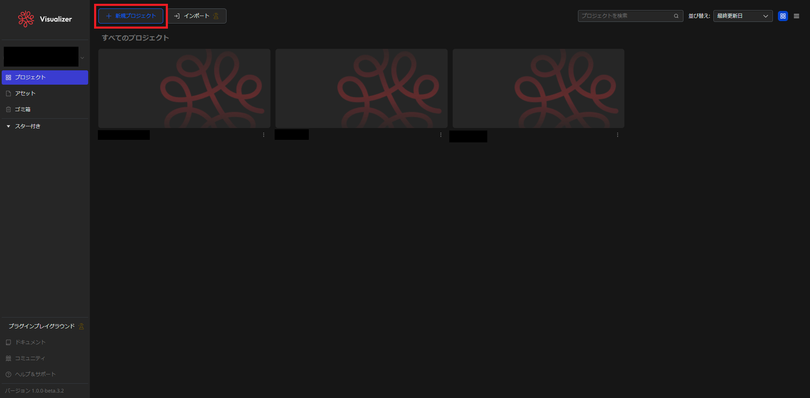

## 4-3 プラグインインストール
作成したプロジェクトを開き、上部のメニュバーのプロジェクト名をクリックし、表示されたメニューから「プラグイン」をクリックします。

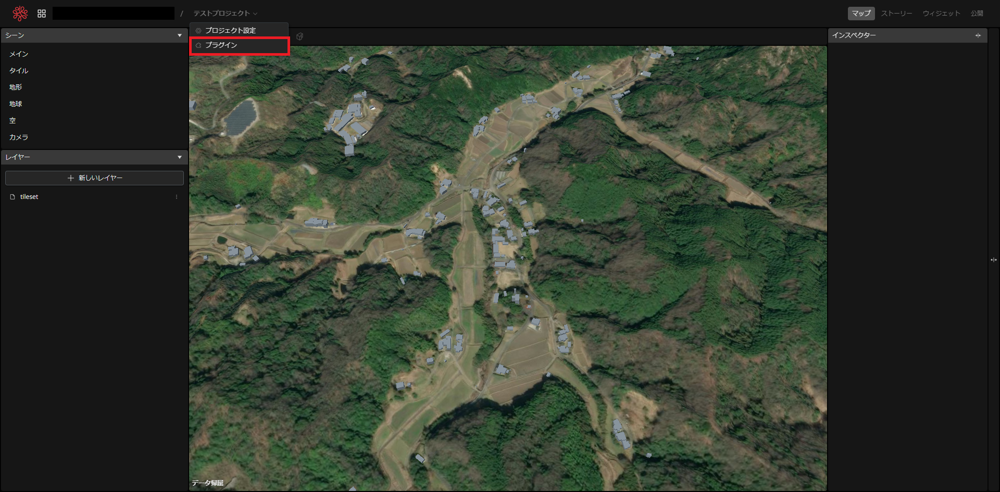

表示された画面で、「個人インストール済み」をクリックします。

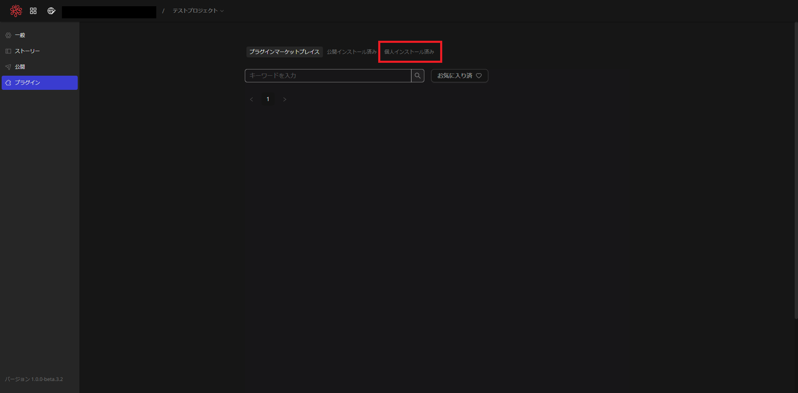

表示された画面で、「PCからZipファイルをアップロード」をクリックします。  
ファイル選択ダイアログが表示されるので、該当するプラグインファイルを選択します。  
この例では「resident.zip」を選択しています。

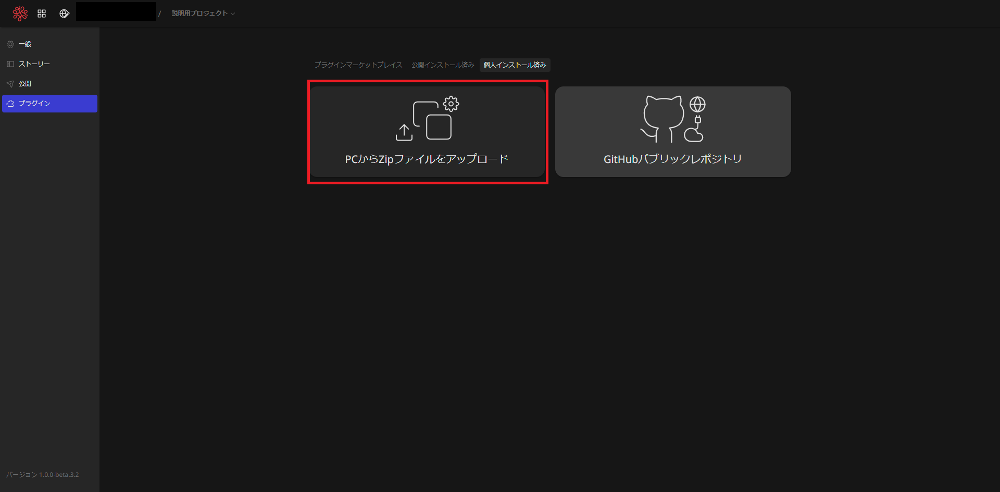

正常に追加されると、下図のようにインストールしたプラグインが表示されます。  
インストールが確認できたら、左上のメニューをクリックし、プロジェクト画面に戻ります。

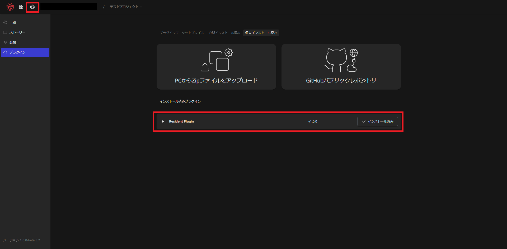

プロジェクト画面に戻ったら、右上の「ウィジェット」を選択します。

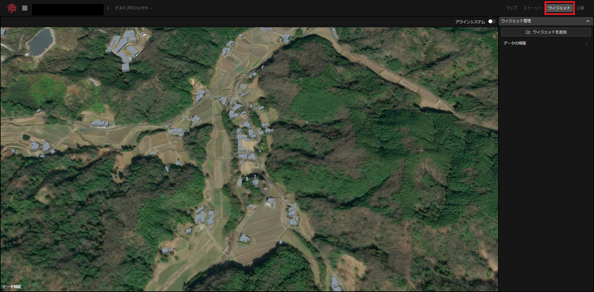

「ウィジェットを追加」ボタンをクリックするとメニューが表示されるので、「resident」をクリックします。

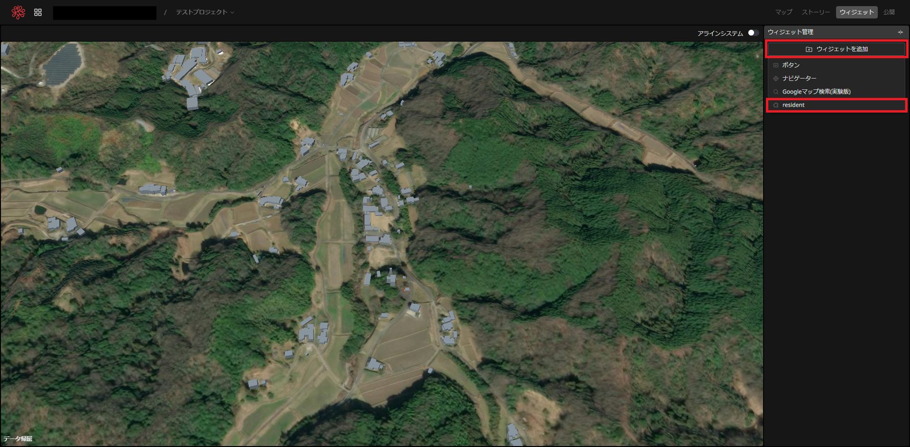

ウィジェット一覧に「resident」が追加され、地図上にダイアログが表示されるとインストール完了です。

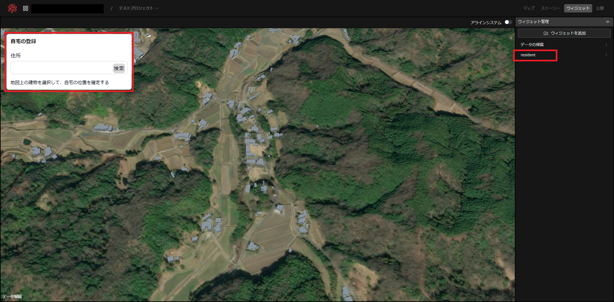

## 4-4 プラグイン設定
プラグインの標準設定を行います。  
このプラグインではサーバと通信を行います。  
ウィジェットから先ほどインストールした「resident」をクリックします。  
右下にインプットボックスが表示されるので、そこのWeb APIのURLを入力します。

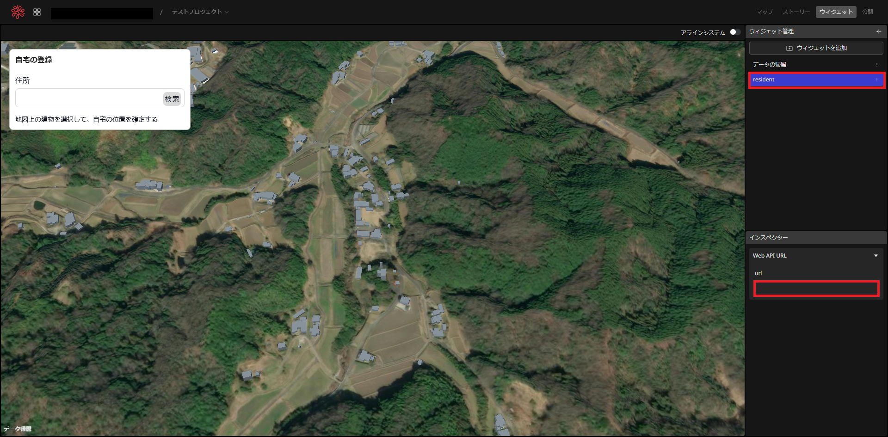

## 4-5 プロジェクト公開
システムで利用するために、プロジェクトを外部公開します。  
右上の「公開」をクリックし、その下に表示される「公開」ボタンをクリックします。

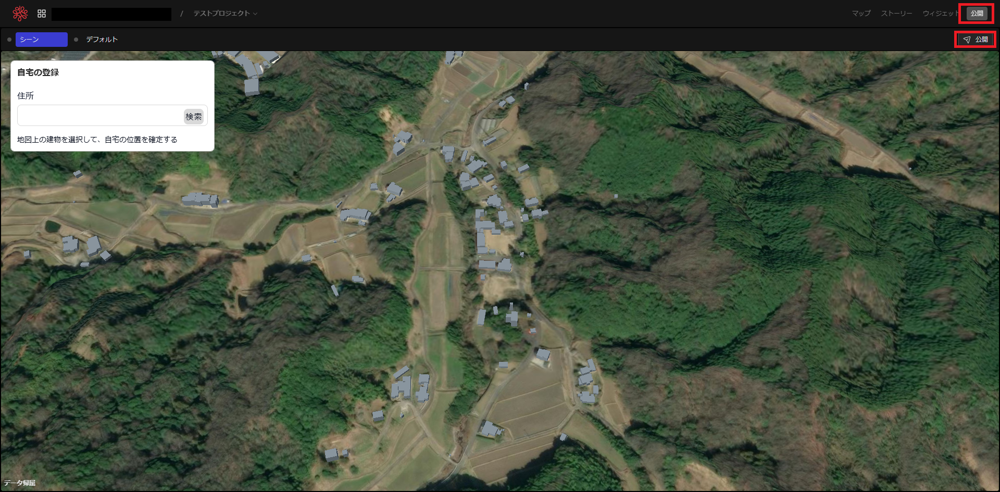

右下の「公開」ボタンをクリックすると公開されます。  
公開ドメインのURLをシステムの設定ファイルの該当箇所に入力します。

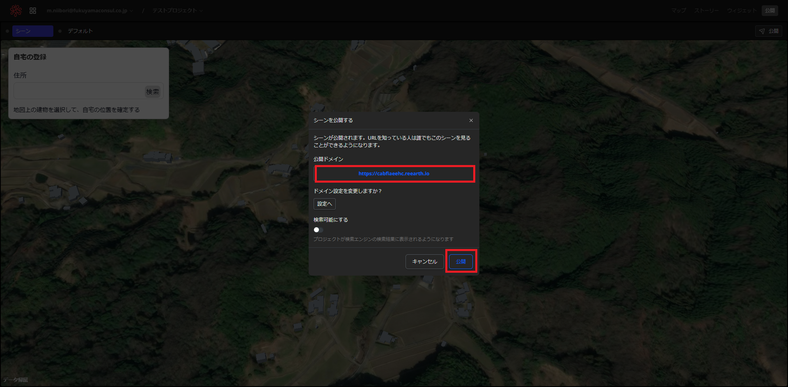