# 操作マニュアル(住民向け)

# 1 本書について

本書では、地区防災計画作成支援システム（以下 本システム）の住民向け機能の操作手順について記載しています。  
  
住民向け機能では、主に自宅のリスク表示、避難ルート検索、個別避難計画の作成ができます。  

# 2 ログイン
## 2-1 ログイン画面
Webブラウザから所定のURLにアクセスすると、以下のログイン画面が表示されます。

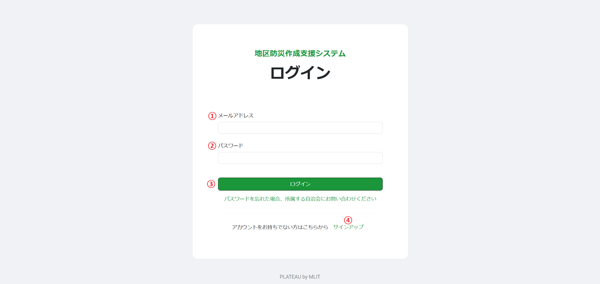

①メールアドレス  
登録されたメールアドレスを入力します。

②パスワード  
登録されたパスワードを入力します。

③ログインボタン  
登録されたユーザIDとパスワードを入力後、ログインボタンを押下して本システムへログインします。  
登録されていないユーザは、④サインアップをクリックして、新規にユーザ登録を作成します。  

④サインアップ  
新規にユーザを登録する場合は、こちらをクリックするとユーザ登録画面に移動します。

## 2-2 ユーザ登録画面
ログイン画面からサインアップをクリックすると、以下のユーザ登録画面が表示されます。

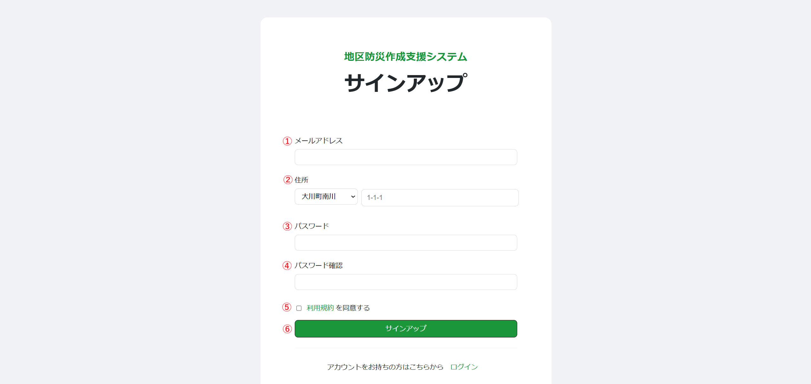

①メールアドレス  
登録するメールアドレスを入力します。

②住所  
登録する住所を入力します。  
ここで表示される選択肢は、住所情報登録で登録されたものが表示されます。

③パスワード  
登録するパスワードを入力します。

④パスワード確認  
登録するパスワードを入力します。

⑤利用規約  
利用規約の文字をクリックすると利用規約が表示されます。  
同意する場合は、チェックボックスにチェックをいれます。

⑥サインアップ  
新規にユーザを登録する場合は、このボタンをクリックします。  
なお、このーページに登録できるユーザは、権限が住民だけとなります。

## 2-3 ログイン後画面
下図ページが表示されます。

サインアップ時
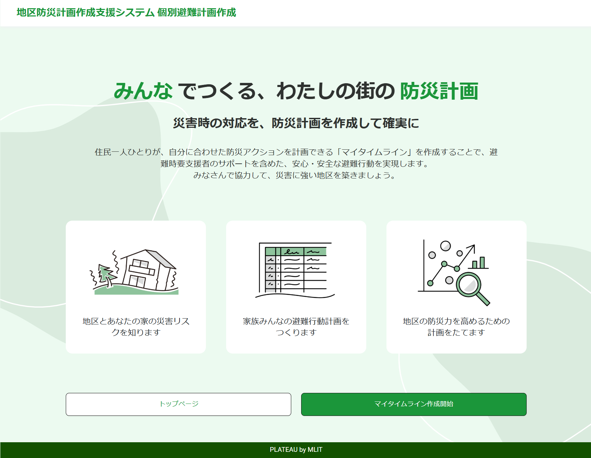

ログイン時

# 3 住民向け
住民のトップページは以下となります。

①住民情報  
自宅、家族情報、緊急連絡先といった基本情報を登録します。

②リスク情報確認  
登録された自宅の情報から、自宅及び周辺の災害リスク情報を表示します。

③避難情報  
避難時についての情報を登録します。

③避難ルート検索  
登録された自宅から避難場所までの避難ルート検索を行います。

⑤避難のタイミング  
災害時における避難のタイミングを登録します。

⑥非常持出  
避難時に持ち出すリストを作成します。

⑦個別避難計画  
①～⑥で登録した情報から個別品計画を作成、ダウンロードします。

⑧リスク情報登録  
自宅の周りのリスク情報を登録します。

## 3-1 住民情報
基本情報を登録します。

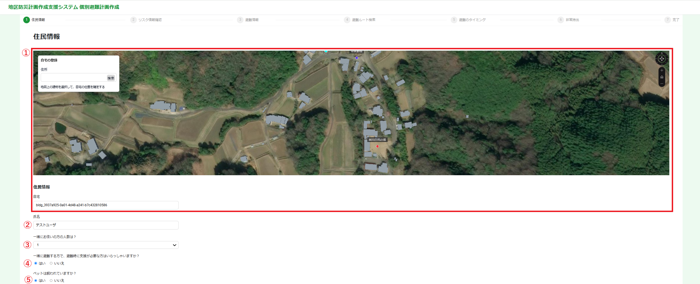

①自宅登録  
地図上に表示されている建物をクリックして自宅を選択します。  
選択された建物は赤色で着色されます。

②氏名  
登録する氏名を入力します。

③家族人数  
選択された人数分、家族情報に登録フォームが追加されます。

④避難時に支援が必要な方いるか？  
はい、いいえを選択します。

⑤ペットの有無  
はい、いいえを選択します。

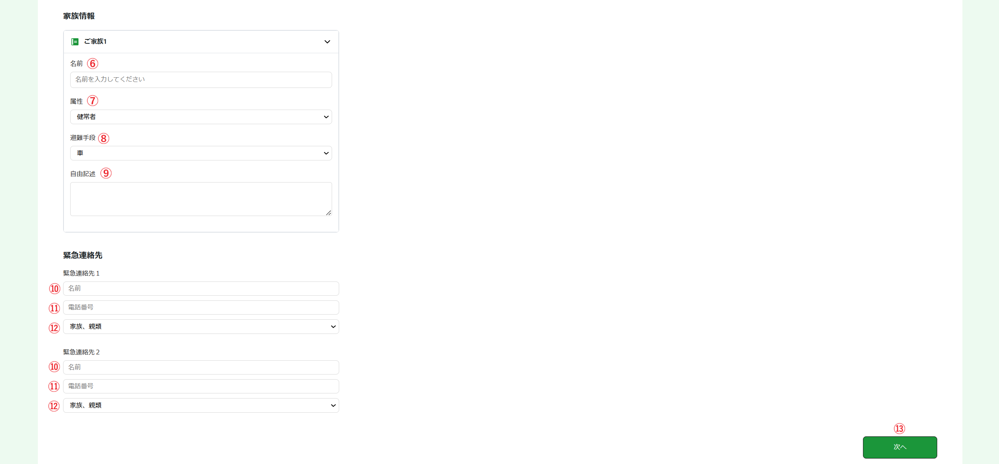

⑥家族情報(名前)  
家族の名前を入力します。

⑦家族情報(属性)  
家族の属性を選択します。

⑧家族情報(避難手段)  
避難手段を選択します。

⑨家族情報(自由記述)  
その他情報があればここに記載します。

⑩緊急連絡先(名前)  
緊急連絡先の名前を入力します。

⑪緊急連絡先(電話番号)  
緊急連絡先の電話番号を入力します。

⑫緊急連絡先(属性)  
緊急連絡先の人の属性を選択します。

⑬次へ  
このボタンをクリックすると、上記の情報を登録し、先に進みます。

## 3-2 リスク情報確認
自宅のリスクおよび自宅周辺のリスク情報が表示されます。

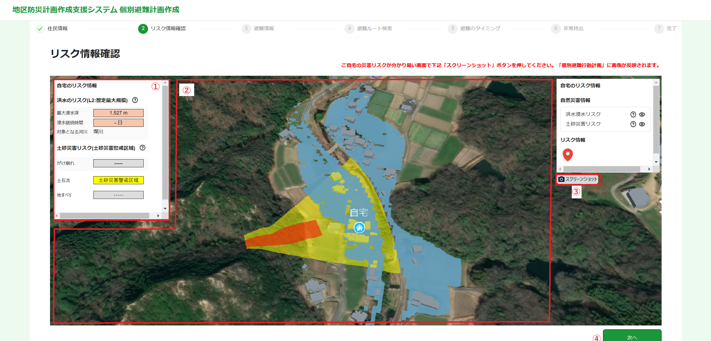

①自宅のリスク  
自宅のリスクが表示されます。

②自宅周辺のリスク  
自宅周辺のリスク情報です。

③スクリーンショット  
スクリーンショットボタンをクリックすると、現在表示されている地図がキャプチャされます。  
このキャプチャ画像は、個別避難計画に利用されます。

④次へ  
このボタンをクリックすると、キャプチャ画像を登録し、次に進みます。

## 3-3 避難情報
避難に関する情報を登録します。

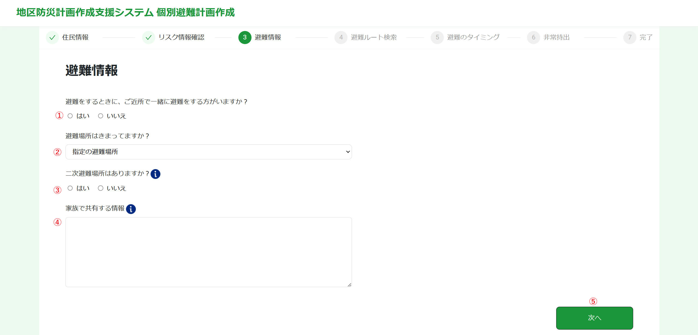

①避難時に、ご近所に一緒に避難する方がいるか  
はい、いいえを選択します。

②避難場所はきまっているか  
選択します。

③二次避難場所はあるか  
はい、いいえを選択します。

④家族で共有する情報  
あらかじめ家族で共有しておく情報を自由入力します。

⑤次へ  
このボタンをクリックすると、上記情報を登録し、次に進みます。

## 3-4 避難ルート検索
登録した自宅からの避難ルートを検索します。

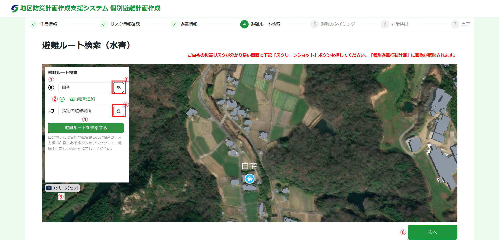

①自宅  
住民情報で登録した自宅が中心となった地図が表示されます。

②経由地  
「経由地を追加」ボタンをクリックすると、経由地が選択されます。  
ボタンをクリックし、経由地の建物を選択します。  
選択された経由地は、青色で着色されます。

③目的地  
基本的には、指定の避難場所を目的とします。  
目的地を変更する場合は、ボタンをクリックし、目的地の建物を選択します。  
選択された目的地は、緑色で着色されます。

④避難ルートを検索する  
このボタンをクリックすると、避難ルート検索が行われ、結果が地図上に描画されます。

⑤スクリーンショット  
スクリーンショットボタンをクリックすると、現在表示されている避難ルート地図がキャプチャされます。  
このキャプチャ画像は、個別避難計画に利用されます。

⑥次へ  
このボタンをクリックすると、上記情報を登録し、次に進みます。

## 3-5 避難のタイミング
避難のタイミングを登録します。

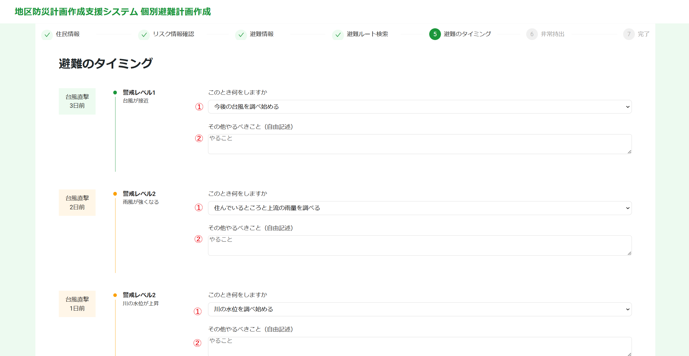

①このとき何をするか  
タイミングごとに何をするか選択します。

②その他やるべきこと(自由記述)  
タイミングごとに何をするか自由記述します。

③次へ  
このボタンをクリックすると、上記情報を登録し、次に進みます。

## 3-6 非常持出
非常時に持ち出すリストを作成します。

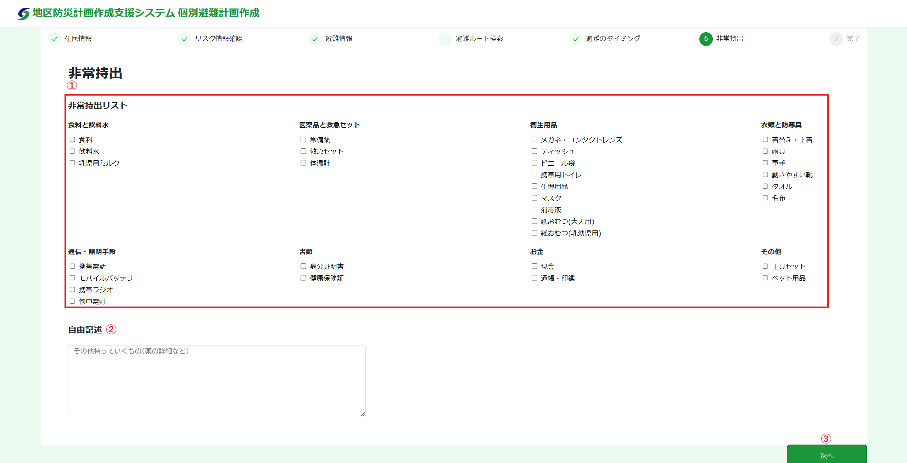

①リスト作成  
持ち出すものをリスト一覧のチェックボックスにチェックします。

②自由記述  
常備薬などリスト一覧にない情報を入力します。

③次へ  
このボタンをクリックすると、上記情報を登録し、次に進みます。

## 3-7 個別避難計画
①～⑥の情報をもとに個別避難計画を作成します。

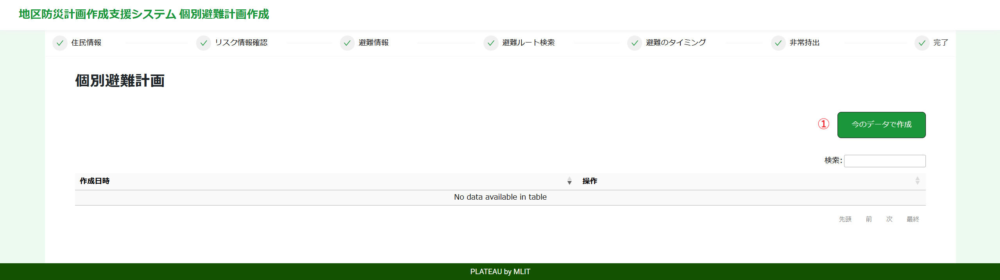

①今のデータで作成  
個別避難計画を作成します。

②ダウンロード  
個別避難計画をダウンロードします。  
Excel形式およびPDF形式でダウンロードできます。

## 3-8 リスク情報登録
自宅周辺のリスク情報を登録します。

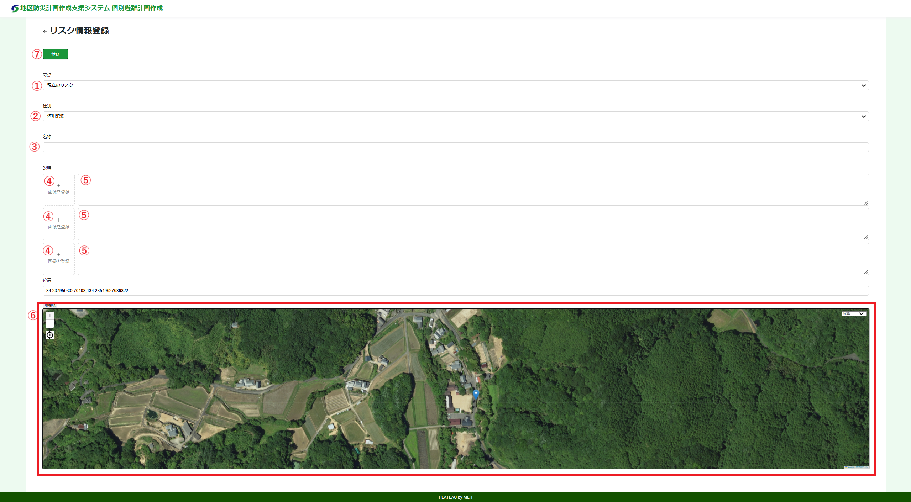

①時点  
現在のリスク、過去のリスク、を選択します。

②種別  
河川氾濫、土砂災害、道路、建物、その他、を選択します。

③名称  
名称を入力します。

④説明(画像)  
画像を選択します。

⑤説明(文章)  
説明文(自由記述)を入力します。

⑥地図  
該当箇所を地図上をクリックして選択します。  
選択した場所にマーカーが設置されます。

⑦保存  
上記情報を登録します。
