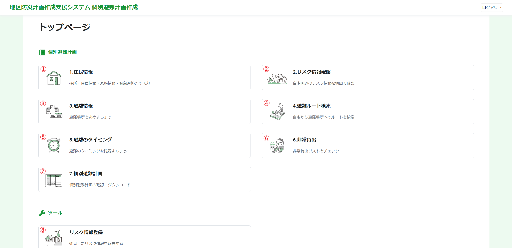
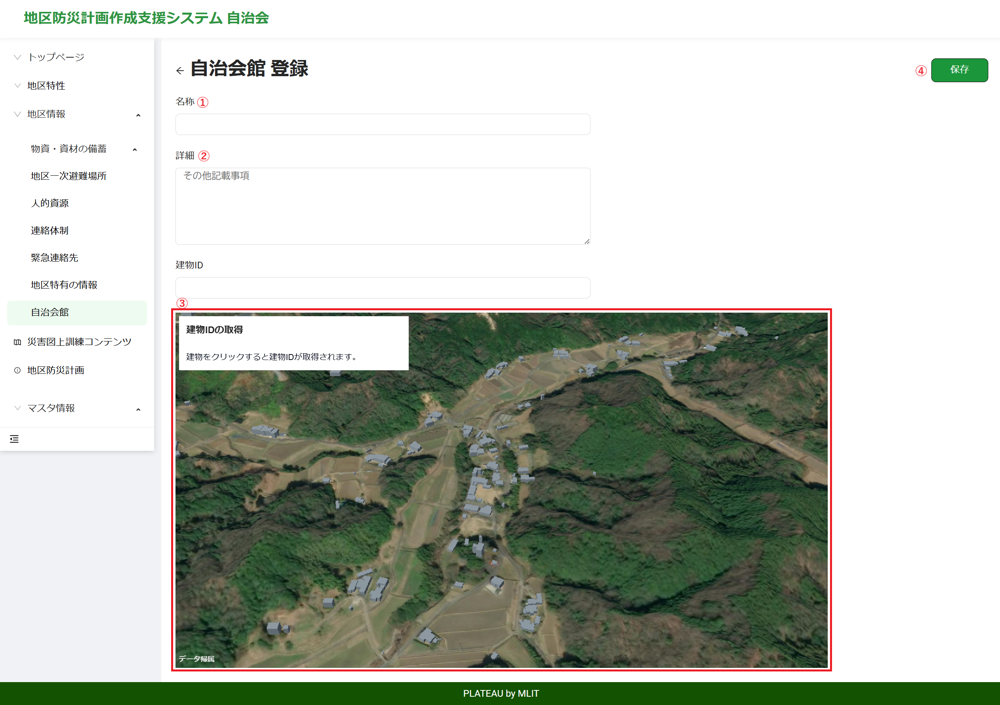
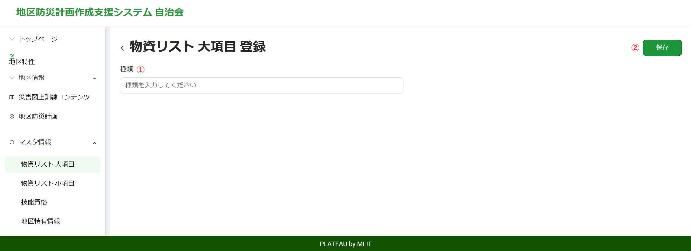
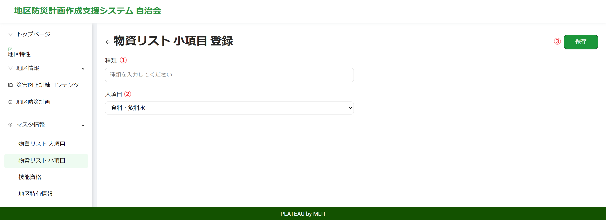

# 操作マニュアル

# 1 本書について

本書では、地区防災計画作成支援システム（以下 本システム）の操作手順について記載しています。

# 2 ログイン
## 2-1 ログイン画面
Webブラウザから所定のURLにアクセスると、以下のログイン画面が表示されます。

①メールアドレス  
登録されたメールアドレスを入力します。

②パスワード  
登録されたパスワードを入力します。

③ログインボタン  
登録されたユーザIDとパスワードを入力後、ログインボタンを押下して本システムへログインします。

④サインアップ  
新規にユーザを登録する場合は、こちらをクリックするとユーザ登録画面に移動します。

## 2-2 ユーザ登録画面
ログイン画面からサインアップをクリックすると、以下のユーザ登録画面が表示されます。

①メールアドレス  
登録するメールアドレスを入力します。

②住所  
登録する住所を入力します。  
ここで表示される選択肢は、住所情報登録で登録されたものが表示されます。

③パスワード  
登録するパスワードを入力します。

④パスワード確認  
登録するパスワードを入力します。

⑤利用規約  
利用規約の文字をクリックすると利用規約が表示されます。  
同意する場合は、チェックボックスにチェックをいれます。

⑥サインアップ  
新規にユーザを登録する場合は、このボタンをクリックします。  
なお、このーページに登録できるユーザは、権限が住民だけとなります。

## 2-3 ログイン後画面
ユーザの権限に応じて各ページが表示されます。

### 2-3-1 住民

サインアップ時

ログイン時

### 2-3-2 自治会

### 2-3-3 行政

# 3 住民
住民のトップページは以下となります。

①住民情報  
自宅、家族情報、緊急連絡先といった基本情報を登録します。

②リスク情報確認  
登録された自宅の情報から、自宅及び周辺の災害リスク情報を表示します。

③避難情報  
避難時についての情報を登録します。

③避難ルート検索  
登録された自宅から避難場所までの避難ルート検索を行います。

⑤避難のタイミング  
災害時における避難のタイミングを登録します。

⑥非常持出  
避難時に持ち出すリストを作成します。

⑦個別避難計画  
①～⑥で登録した情報から個別品計画を作成、ダウンロードします。

⑧リスク情報登録  
自宅の周りのリスク情報を登録します。

## 3-1 住民情報
基本情報を登録します。

①自宅登録  
地図上に表示されている建物をクリックして自宅を選択します。  
選択された建物は赤色で着色されます。

②氏名  
登録する氏名を入力します。

③家族人数  
選択された人数分、家族情報に登録フォームが追加されます。

④避難時に支援が必要な方いるか？  
はい、いいえを選択します。

⑤ペットの有無  
はい、いいえを選択します。

⑥家族情報(名前)  
家族の名前を入力します。

⑦家族情報(属性)  
家族の属性を選択します。

⑧家族情報(避難手段)  
避難手段を選択します。

⑨家族情報(自由記述)  
その他情報があればここに記載します。

⑩緊急連絡先(名前)  
緊急連絡先の名前を入力します。

⑪緊急連絡先(電話番号)  
緊急連絡先の電話番号を入力します。

⑫緊急連絡先(属性)  
緊急連絡先の人の属性を選択します。

⑬次へ  
このボタンをクリックすると、上記の情報を登録し、先に進みます。

## 3-2 リスク情報確認
自宅のリスクおよび自宅周辺のリスク情報が表示されます。

①自宅のリスク  
自宅のリスクが表示されます。

②自宅周辺のリスク  
自宅周辺のリスク情報です。

③スクリーンショット  
スクリーンショットボタンをクリックすると、現在表示されている地図がキャプチャされます。  
このキャプチャ画像は、個別避難計画に利用されます。

④次へ  
このボタンをクリックすると、キャプチャ画像を登録し、次に進みます。

## 3-3 避難情報
避難に関する情報を登録します。

①避難時に、ご近所に一緒に避難する方がいるか  
はい、いいえを選択します。

②避難場所はきまっているか  
選択します。

③二次避難場所はあるか  
はい、いいえを選択します。

④家族で共有する情報  
あらかじめ家族で共有しておく情報を自由入力します。

⑤次へ  
このボタンをクリックすると、上記情報を登録し、次に進みます。

## 3-4 避難ルート検索
登録した自宅からの避難ルートを検索します。

①自宅  
住民情報で登録した自宅が中心となった地図が表示されます。

②経由地  
「経由地を追加」ボタンをクリックすると、経由地が選択されます。  
ボタンをクリックし、経由地の建物を選択します。  
選択された経由地は、青色で着色されます。

③目的地  
基本的には、指定の避難場所を目的とします。  
目的地を変更する場合は、ボタンをクリックし、目的地の建物を選択します。  
選択された目的地は、緑色で着色されます。

④避難ルートを検索する  
このボタンをクリックすると、避難ルート検索が行われ、結果が地図上に描画されます。

⑤スクリーンショット  
スクリーンショットボタンをクリックすると、現在表示されている避難ルート地図がキャプチャされます。  
このキャプチャ画像は、個別避難計画に利用されます。

⑥次へ  
このボタンをクリックすると、上記情報を登録し、次に進みます。

## 3-5 避難のタイミング
避難のタイミングを登録します。

①このとき何をするか  
タイミングごとに何をするか選択します。

②その他やるべきこと(自由記述)  
タイミングごとに何をするか自由記述します。

③次へ  
このボタンをクリックすると、上記情報を登録し、次に進みます。

## 3-6 非常持出
非常時に持ち出すリストを作成します。

①リスト作成  
持ち出すものをリスト一覧のチェックボックスにチェックします。

②自由記述  
常備薬などリスト一覧にない情報を入力します。

③次へ  
このボタンをクリックすると、上記情報を登録し、次に進みます。

## 3-7 個別避難計画
①～⑥の情報をもとに個別避難計画を作成します。

①今のデータで作成  
個別避難計画を作成します。

②ダウンロード  
個別避難計画をダウンロードします。  
Excel形式およびPDF形式でダウンロードできます。

## 3-8 リスク情報登録
自宅周辺のリスク情報を登録します。

①時点  
現在のリスク、過去のリスク、を選択します。

②種別  
河川氾濫、土砂災害、道路、建物、その他、を選択します。

③名称  
名称を入力します。

④説明(画像)  
画像を選択します。

⑤説明(文章)  
説明文(自由記述)を入力します。

⑥地図  
該当箇所を地図上をクリックして選択します。  
選択した場所にマーカーが設置されます。

⑦保存  
上記情報を登録します。

# 4 自治会
自治会のトップページは以下になります。

①地区特性  
その地区の災害特性を登録します。

②地区情報  
その地区のさまざまな情報を登録します。

③災害図上訓練コンテンツ  
地図上で行う訓練コンテンツを表示し、訓練内容を登録します。

④地区防災計画  
地区防災計画を作成、ダウンロードします。

④マスタ情報  
システム全体で利用するマスタ情報の登録をします。

## 4-1 地区特性
地区の災害特性を登録、編集、削除します。

### 4-1-1 表示
登録されている地区特性が一覧で表示されます。

### 4-1-2 登録、編集
地区特性の登録、編集を行います。

①地区特性  
地区特性をテキスト入力します。

②詳細  
地区特性の内容をテキスト入力します。

③画像  
画像を選択し、アップロードします。

④保存  
ボタンをクリックすると地区特性を登録します。

### 4-1-3 削除
地区特性の削除を行います。

## 4-2 倉庫リスト
防災倉庫の登録、編集、削除をします。

### 4-2-1 表示
登録されている倉庫が一覧で表示されます。

### 4-2-2 登録、編集
倉庫の登録、編集を行います。

①名称  
名称をテキスト入力します。

②建物  
地図上に表示されている建物をクリックして倉庫を選択します。

③保存  
ボタンをクリックすると倉庫を登録します。

### 4-2-3 削除
倉庫の削除を行います。

## 4-3 物資リスト
防災倉庫に備蓄している物資の登録、編集、削除をします。

### 4-3-1 表示
登録されている物資の一覧が表示されます。

### 4-3-2 登録、編集
物資の登録、編集を行います。

①種類  
種類を選択します。  
ここで表示される種類は、マスタ情報(物資リスト 大項目)となっています。

②品目  
品目を選択します。  
ここで表示される品目は、マスタ情報(物資リスト 小項目)となっています。

③数量  
数量をテキスト入力します。

④倉庫  
倉庫を選択します。  
ここで表示される倉庫は、4-2 倉庫リストで登録した倉庫です。

⑤保存  
ボタンをクリックすると物資を登録します。

### 4-3-3 削除
物資の削除を行います。

## 4-4 地区一次避難場所
地区で定めている一次避難場所の登録、編集、削除をします。

### 4-4-1 表示
登録されている地区一次避難場所が表示されます。

### 4-4-2 登録、編集
地区一次避難場所の登録、編集を行います。

①名称  
名称をテキスト入力します。

②種別  
種別を避難場所、避難所、から選択します。

③備考  
備考をテキスト入力します。

④建物  
地図上に表示されている建物をクリックして地区一次避難場所を選択します。

⑤保存  
ボタンをクリックすると地区一次避難場所を登録します。

### 4-4-3 削除
地区一次避難場所の削除を行います。

## 4-5 人的資源
地区の人材の登録、編集、削除をします。

### 4-5-1 表示
登録されている人的資源が表示されます。

### 4-5-2 登録、編集
人的資源の登録、編集を行います。

①氏名  
氏名をテキスト入力します。

②連絡先  
連絡先をテキスト入力します。

③技能・資格  
資格・技能を選択します。  
1人につき4つまで選択できます。  
ここで表示される技能・資格は、マスタ情報(技能資格)となっています。

④備考  
備考をテキスト入力します。

⑤保存  
ボタンをクリックすると人的資源を登録します。

### 4-5-3 削除
人的資源の削除を行います。

## 4-6 連絡体制
地区の連絡網を登録します。

### 4-6-1 表示
登録されている連絡体制が表示されます。

### 4-6-2 登録、編集
連絡体制の登録、編集を行います。

## 4-7 緊急連絡先
地区で定めている緊急連絡先の登録、編集、削除をします。

### 4-7-1 表示
登録されている緊急連絡先が表示されます。

### 4-7-2 登録、編集
緊急連絡先の登録、編集を行います。

①連絡先  
連絡先をテキスト入力します。

②電話番号  
電話番号をテキスト入力します。

③建物  
地図上に表示されている建物をクリックして緊急連絡先を選択します。

④保存  
ボタンをクリックすると緊急連絡先を登録します。

### 4-7-3 削除
緊急連絡先の削除を行います。

## 4-8 地区特有の情報
地区の特有な情報を登録、編集、削除をします。

### 4-8-1 表示
登録されている地区特有の情報が表示されます。

### 4-8-2 登録、編集
地区特有の情報の登録、編集を行います。

①種別  
種別を選択します。  
ここで表示される種別は、マスタ情報(地区特有情報)となっています。

②名称  
名称をテキスト入力します。

③画像  
画像を選択します。

④画像詳細  
画像の詳細を入力します。

⑤保存
ボタンをクリックすると地区特有の情報を登録します

### 4-8-3 削除
地区特有の情報の削除を行います。

## 4-9 自治会館
自治会館の登録、編集、削除をします。

### 4-9-1 表示
登録されて自治会館が表示されます。

### 4-9-2 登録、編集
自治会館の登録、編集を行います。

①名称  
名称をテキスト入力します。

②詳細  
詳細をテキスト入力します。

③建物  
地図上に表示されている建物をクリックして自治会館を選択します。

④保存
ボタンをクリックすると自治会館を登録します

### 4-9-3 削除
自治会館の削除を行います。

## 4-10 災害図上訓練コンテンツ
災害図上訓練コンテンツの表示、訓練内容の登録をします。

### 4-10-1 表示
登録されている訓練内容を表示します。

### 4-10-2 登録、編集
対象となる災害図上訓練コンテンツを表示します。

①訓練内容  
訓練内容をテキスト入力します。

②保存  
訓練内容を保存します。

### 4-10-3 削除
訓練内容を削除します。

## 4-11 地区防災計画
地区防災計画の作成、ダウンロードをします。

### 4-11-1 表示
作成されている地区防災計画を表示し、ダウンロードします。

### 4-11-2 作成
現在入力されている内容で、地区防災計画を作成します。

### 4-11-3 ダウンロード
対象の地区防災計画をExcel形式、またはPDF形式でダウンロードします。

## 4-12 物資リスト 大項目
物資マスタ(大項目)の登録、編集、削除をします。

### 4-12-1 表示
登録されている物資マスタ(大項目)が表示されます。

### 4-12-2 登録、編集
物資マスタ(大項目)の登録、編集を行います。

①種類  
種類をテキスト入力します。

②保存  
物資マスタ(大項目)を登録します。

### 4-12-3 削除
物資マスタ(大項目)の削除を行います。

## 4-13 物資リスト 小項目
物資マスタ(小項目)の登録、編集、削除をします。

### 4-13-1 表示
登録されている物資マスタ(小項目)が表示されます。

### 4-13-2 登録、編集
物資マスタ(小項目)の登録、編集を行います。

①種類  
種類をテキスト入力します。

②大項目  
大項目を選択します。  
ここに表示される大項目は、物資マスタ(大項目)となります。

③保存  
物資マスタ(小項目)を登録します。

### 4-13-3 削除
物資マスタ(小項目)の削除を行います。

## 4-14 技能資格
人的資源で表示する技能資格マスタの登録、編集、削除をします。

### 4-14-1 表示
登録されている技能資格が表示されます。

### 4-14-2 登録、編集
技能資格の登録を行います。

①種類  
種類をテキスト入力します。

②保存  
技能資格を登録します。

### 4-14-3 削除
技能資格の削除を行います。

## 4-15 地区特有情報
地区特有の情報で表示する地区特有マスタの登録、編集、削除をします。

### 4-15-1 表示
登録されいる地区特有マスタが表示されます。

### 4-15-2 登録、編集
地区特有マスタの登録、編集を行います。

①種別  
種別をテキスト入力します。

②保存  
地区特有マスタの登録を行います。

### 4-15-3 削除
地区特有マスタの削除を行います。

# 5 行政
行政のトップページは以下になります。

①地区防災計画確認  
各地区の地区防災計画を表形式で確認できます。  
また、地区防災計画のダウンロードができます。

②地区防災計画確認(地図)  
各地区の地区防災計画の作成状況を地図で確認できます。
