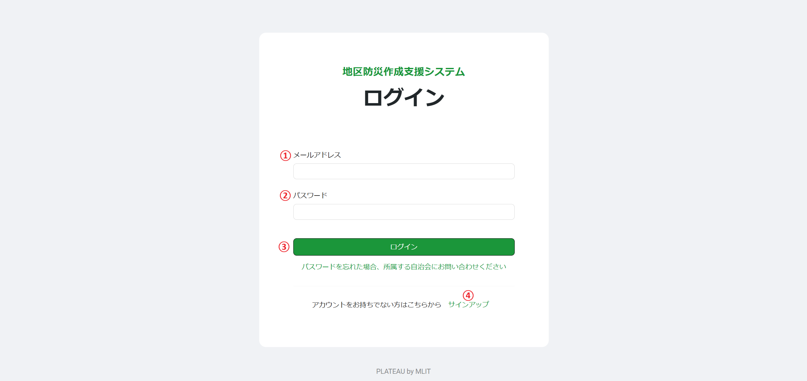

# 操作マニュアル(自治会向け)

# 1 本書について

本書では、地区防災計画作成支援システム（以下 本システム）の自治会向けの機能操作手順について記載しています。  
  
自治会向け機能は、主に地区の情報管理と地区防災計画の作成ができます。  

# 2 ログイン
## 2-1 ログイン画面
Webブラウザから所定のURLにアクセスすると、以下のログイン画面が表示されます。

①メールアドレス  
登録されたメールアドレスを入力します。

②パスワード  
登録されたパスワードを入力します。

③ログインボタン  
登録されたユーザIDとパスワードを入力後、ログインボタンを押下して本システムへログインします。  
登録されていないユーザは、④サインアップをクリックして、新規にユーザ登録を作成します。  

④サインアップ  
新規にユーザを登録する場合は、こちらをクリックするとユーザ登録画面に移動します。  
自治会ユーザはこの機能では、新規作成はできません。  

## 2-2 ログイン後画面
下図ページが表示されます。

# 3 自治会向け
自治会のトップページは以下になります。

①地区特性  
その地区の災害特性を登録します。

②地区情報  
その地区のさまざまな情報を登録します。

③災害図上訓練コンテンツ  
地図上で行う訓練コンテンツを表示し、訓練内容を登録します。

④地区防災計画  
地区防災計画を作成、ダウンロードします。

④マスタ情報  
システム全体で利用するマスタ情報の登録をします。

## 3-1 地区特性
地区の災害特性を登録、編集、削除します。

### 3-1-1 表示
登録されている地区特性が一覧で表示されます。

### 3-1-2 登録、編集
地区特性の登録、編集を行います。

①地区特性  
地区特性をテキスト入力します。

②詳細  
地区特性の内容をテキスト入力します。

③画像  
画像を選択し、アップロードします。

④保存  
ボタンをクリックすると地区特性を登録します。

### 3-1-3 削除
地区特性の削除を行います。

## 3-2 倉庫リスト
防災倉庫の登録、編集、削除をします。

### 3-2-1 表示
登録されている倉庫が一覧で表示されます。

### 3-2-2 登録、編集
倉庫の登録、編集を行います。

①名称  
名称をテキスト入力します。

②建物  
地図上に表示されている建物をクリックして倉庫を選択します。

③保存  
ボタンをクリックすると倉庫を登録します。

### 3-2-3 削除
倉庫の削除を行います。

## 3-3 物資リスト
防災倉庫に備蓄している物資の登録、編集、削除をします。

### 3-3-1 表示
登録されている物資の一覧が表示されます。

### 3-3-2 登録、編集
物資の登録、編集を行います。

①種類  
種類を選択します。  
ここで表示される種類は、マスタ情報(物資リスト 大項目)となっています。

②品目  
品目を選択します。  
ここで表示される品目は、マスタ情報(物資リスト 小項目)となっています。

③数量  
数量をテキスト入力します。

④倉庫  
倉庫を選択します。  
ここで表示される倉庫は、4-2 倉庫リストで登録した倉庫です。

⑤保存  
ボタンをクリックすると物資を登録します。

### 3-3-3 削除
物資の削除を行います。

## 3-4 地区一次避難場所
地区で定めている一次避難場所の登録、編集、削除をします。

### 3-4-1 表示
登録されている地区一次避難場所が表示されます。

### 3-4-2 登録、編集
地区一次避難場所の登録、編集を行います。

①名称  
名称をテキスト入力します。

②種別  
種別を避難場所、避難所、から選択します。

③備考  
備考をテキスト入力します。

④建物  
地図上に表示されている建物をクリックして地区一次避難場所を選択します。

⑤保存  
ボタンをクリックすると地区一次避難場所を登録します。

### 3-4-3 削除
地区一次避難場所の削除を行います。

## 3-5 人的資源
地区の人材の登録、編集、削除をします。

### 3-5-1 表示
登録されている人的資源が表示されます。

### 3-5-2 登録、編集
人的資源の登録、編集を行います。

①氏名  
氏名をテキスト入力します。

②連絡先  
連絡先をテキスト入力します。

③技能・資格  
資格・技能を選択します。  
1人につき4つまで選択できます。  
ここで表示される技能・資格は、マスタ情報(技能資格)となっています。

④備考  
備考をテキスト入力します。

⑤保存  
ボタンをクリックすると人的資源を登録します。

### 3-5-3 削除
人的資源の削除を行います。

## 3-6 連絡体制
地区の連絡網を登録します。

### 3-6-1 表示
登録されている連絡体制が表示されます。

### 3-6-2 登録、編集
連絡体制の登録、編集を行います。

## 3-7 緊急連絡先
地区で定めている緊急連絡先の登録、編集、削除をします。

### 3-7-1 表示
登録されている緊急連絡先が表示されます。

### 3-7-2 登録、編集
緊急連絡先の登録、編集を行います。

①連絡先  
連絡先をテキスト入力します。

②電話番号  
電話番号をテキスト入力します。

③建物  
地図上に表示されている建物をクリックして緊急連絡先を選択します。

④保存  
ボタンをクリックすると緊急連絡先を登録します。

### 3-7-3 削除
緊急連絡先の削除を行います。

## 3-8 地区特有の情報
地区の特有な情報を登録、編集、削除をします。

### 3-8-1 表示
登録されている地区特有の情報が表示されます。

### 3-8-2 登録、編集
地区特有の情報の登録、編集を行います。

①種別  
種別を選択します。  
ここで表示される種別は、マスタ情報(地区特有情報)となっています。

②名称  
名称をテキスト入力します。

③画像  
画像を選択します。

④画像詳細  
画像の詳細を入力します。

⑤保存
ボタンをクリックすると地区特有の情報を登録します

### 3-8-3 削除
地区特有の情報の削除を行います。

## 3-9 自治会館
自治会館の登録、編集、削除をします。

### 3-9-1 表示
登録されて自治会館が表示されます。

### 3-9-2 登録、編集
自治会館の登録、編集を行います。

①名称  
名称をテキスト入力します。

②詳細  
詳細をテキスト入力します。

③建物  
地図上に表示されている建物をクリックして自治会館を選択します。

④保存
ボタンをクリックすると自治会館を登録します

### 3-9-3 削除
自治会館の削除を行います。

## 3-10 災害図上訓練コンテンツ
災害図上訓練コンテンツの表示、訓練内容の登録をします。

### 3-10-1 表示
登録されている訓練内容を表示します。

### 3-10-2 登録、編集
対象となる災害図上訓練コンテンツを表示します。

①訓練内容  
訓練内容をテキスト入力します。

②保存  
訓練内容を保存します。

### 3-10-3 削除
訓練内容を削除します。

## 3-11 地区防災計画
地区防災計画の作成、ダウンロードをします。

### 3-11-1 表示
作成されている地区防災計画を表示し、ダウンロードします。

### 3-11-2 作成
現在入力されている内容で、地区防災計画を作成します。

### 3-11-3 ダウンロード
対象の地区防災計画をExcel形式、またはPDF形式でダウンロードします。

## 3-12 物資リスト 大項目
物資マスタ(大項目)の登録、編集、削除をします。

### 3-12-1 表示
登録されている物資マスタ(大項目)が表示されます。

### 3-12-2 登録、編集
物資マスタ(大項目)の登録、編集を行います。

①種類  
種類をテキスト入力します。

②保存  
物資マスタ(大項目)を登録します。

### 3-12-3 削除
物資マスタ(大項目)の削除を行います。

## 3-13 物資リスト 小項目
物資マスタ(小項目)の登録、編集、削除をします。

### 3-13-1 表示
登録されている物資マスタ(小項目)が表示されます。

### 3-13-2 登録、編集
物資マスタ(小項目)の登録、編集を行います。

①種類  
種類をテキスト入力します。

②大項目  
大項目を選択します。  
ここに表示される大項目は、物資マスタ(大項目)となります。

③保存  
物資マスタ(小項目)を登録します。

### 3-13-3 削除
物資マスタ(小項目)の削除を行います。

## 3-14 技能資格
人的資源で表示する技能資格マスタの登録、編集、削除をします。

### 3-14-1 表示
登録されている技能資格が表示されます。

### 3-14-2 登録、編集
技能資格の登録を行います。

①種類  
種類をテキスト入力します。

②保存  
技能資格を登録します。

### 3-14-3 削除
技能資格の削除を行います。

## 3-15 地区特有情報
地区特有の情報で表示する地区特有マスタの登録、編集、削除をします。

### 3-15-1 表示
登録されいる地区特有マスタが表示されます。

### 3-15-2 登録、編集
地区特有マスタの登録、編集を行います。

①種別  
種別をテキスト入力します。

②保存  
地区特有マスタの登録を行います。

### 3-15-3 削除
地区特有マスタの削除を行います。
